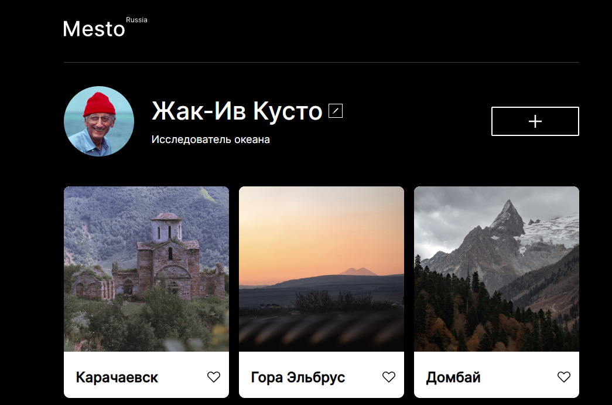

# Проект: Mesto

<a href="https://opigon1.github.io/mesto/">Ссылка GitPages</a>
<h2>Описание</h2>

В 4 проектной работе моим заданием было применить полученные знания в теории и сверстать адаптивный сайт с добавлением JavaScript.

В 5 проектной работой был расщирен функционал сайта:
<ul>
  <li>Плавное открытие и закрытие попапов</li>
  <li>Новый попап добавления карточки</li>
  <li>Новый попап открытой карточки</li>
  <li>Возможность добовлять карточки пользователя</li>
  <li>Возможность ставить лайк карточкам</li>
  <li>Возможность удалять карточки</li>
</ul>

В 6 проектной работе добавлена валидация форм и несколько мелких функций, такие как:
<ul>
  <li>Закрытие попапов на оверлэй</li>
  <li>Закрытие попапов на кнопку 'Escape'</li>
</ul>

<h2>Были применены такие технологии как</h2>
<ul>
  <li>HTML5</li>
  <li>CSS3</li>
  <li>Grid</li>
  <li>Flex</li>
  <li>Адаптивная вёрстка</li>
  <li>@Media</li>
  <li>JavaScript</li>
  <li>ООП</li>
  <li>ES6 Modules</li>
  <li>Webpack</li>
</ul>

Реализованы простые функции JS

Планы на дороботку

<ul>
  <li>подключить Базу данных</li>
  <li>Реальзовать смену аватарки пользователя</li>
  <li>задизайнить форму, через которую пользователи смогут отправить вам комментарий.</li>
</ul>
